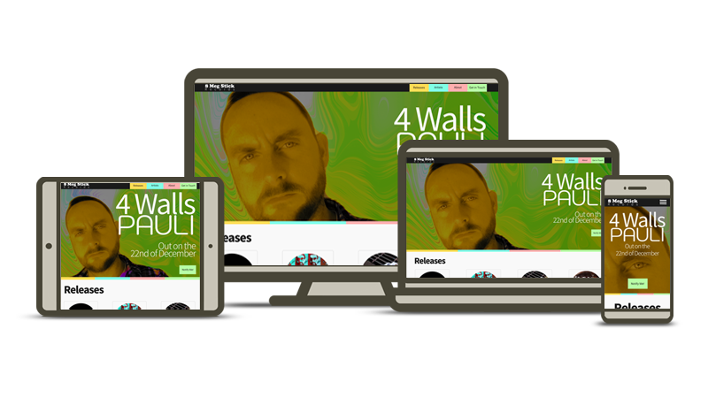

# 8 Meg Stick Records

>
> 8 Meg Stick Records is an emerging independent digital record label with a small roster of artists and releases. The label requires a website to showcase 
their musical releases.
>

The live site has been deployed via GitHub to https://paulwheatcroft.github.io/MS1-8MegStick/

## User Experience (UX)

3 sets of target personas have been identified:

- Music enthusiast
- Musician
- Live music promoter

### Music enthusiast

This persona will have an interest in independent music. **This is the primary target persona for 8 Meg Stick Records**. They will be looking to:
- Links to released music
- Find out information about the artist
- Be able to get updates on releases from the artists

### Musician

A musician will use the website to review the music released by the label with a view to submitting a demo for consideration to be released on the label. They may also wish to assess an artist with a view to partnering over live music opportunities either asking for support roles or to offer support roles.
- Found out about the label's ethos
- Find out information about the artist on the label
- Listen to music
- View live music videos
- Links to released music
- Be able to contact the label

### Live Music Promoter

This persona will be interested in understanding the suitability and capability of an artist before offering a gig opportunity.
- Find out information on the artist
- View live music videos
- Listen to music
- Be able to contact the label

### User Stories

Using the targeted personas, the following list of user stories have been identified to fulfil their needs.

- As a music enthusiast I want to easily find links to tracks on music streaming sites
- As a music enthusiast I want to be able to find out information on an artist
- As a music enthusiast I can receive updates on new releases
- as a musician I can find out information about the record label
- as a musician I can contact the label to send my demo
- As a live music promoter I can listen to what the artist sounds like
- as a live music promoter I can watch a video of an artist
- as a live music promoter I can contact the label about an artist

## Design Choices

The persona that 8 Meg Stick Records wish to primarily target are likely to be viewing the site on a phone. Therefore the site will be a mobile first approach.

The number one feature is links from each release to 6 of the most popular streaming platforms. These are:

- Spotify
- Apple Music
- YouTube Music
- Amazon Music
- Deezer
- Tidal

The look and feel of the site needs to be built around the 8 Meg Stick Records branding. The website needs to feel modern, vivid with vibrant and dynamic touches. The tone should
be professional but not corporate.

Below is the brand colour pallet for 8 Meg Stick Records. Whilst these form the foundation of the colour scheme other strong colours will be required to support vibrant 
accents on the website. Bold use of band photography and imagery is encouraged.

| Description | Hex Colour Value |
| --- | ----------- |
| Dark grey which can be used extensively | #1a1a1a |
| Off white which can be used extensively | #f9f9f9 |
| Light yellow to be used as a primary colour | #ffdd55 |
| Darker yellow to be used as a secondary supportive colour | #d4aa00 |
| Sky blue to be used as a main highlight colour | #80ffe6 |
| Complimentary supporting  pink highlight colour | #ffaeae |
| Complimentary supporting  green highlight colour | #b7ffa5 |

The main font used in the 8 Meg Stick Records logo is not available as a web font. This is a serif font. No other serif fonts should be used as may detract from the logo. 

The secondary font used in the logo is Noto Sans TC. This is available as a web font and will be used for headings.

Noto Sans will be used as the main content font as this is a complimentary font to Noto Sans TC.  

## Structure

Whilst the focus is on a mobile first design the website needs to provide an optimal experience across all screen types.

To ensure the experience is focussed on the releases this will be a multi-page website consisting of 4 pages.

1. Releases
2. Artists
3. About
4. Get in Touch

There is a horizontal navigation bar at the top of each page facilitating access to other pages on the site. This navigation element will collapse on a mobile device.

The index.html page will contain the releases connect as this is the main focus of the site. All other pages follow a consistent look and feel to the main page including 
the same footer element which contain the record labels social media links.

### The Releases Page

The top of the page consists strong imagery advertising the latest release or next up and coming release from the record label. This section enables the 
viewer to sign up for new music release alerts from the label. This section needed to take up most but not all of the viewing area as to reveal the releases
beneath the hero image. The releases will be in in chronological order of their release date. 
Each release section should display:

- Song title
- Artist name which links to the artist profile that will be situated on the artists page
- Cover art
- Links to streaming services

### The Artists Page

Beneath the navigation bar which is common to all of the pages the Artists page will contain a section on each artist. This progresses down the page in alphabetical order. 
Each artist section contains:

- Artist name
- Biography of the artist
- Links to their tracks on the releases page
- Photos and imagery (if available)
- Videos (if available)
- Social media links (if available)
- Any other links that support the artists profile

### The About Page

Beneath the navigation bar which is common to all of the pages the About page will contain a section on the record label. This section will contain:

- An overview of the record label
- Outline the record label ethos and musical direction
- link to a form to submit a demo

### The Get in Touch Page

Beneath the navigation bar which is common to all of the pages the Get in Touch page will contain 3 forms.

1. A form to register or notifications of new releases
2. A form to submit a demo
3. A general contact form

## Wireframing

Mocking up of the site was done using Figma. I chose to use full images and colour as opposed to sketch/line drawings as the site would have many images and elements and therefore be visually busy so I needed to understand the relationships of these images such as the release cover art.

A Figma wireframe for each page can be found in the links Below.

[Releases - index.html](https://www.figma.com/file/lbEOracgvjZ4jw3uFd6hJd/8-Meg-Stick-Records?node-id=0%3A1)

[Artists](https://www.figma.com/file/lbEOracgvjZ4jw3uFd6hJd/8-Meg-Stick-Records?node-id=31%3A2)

[About](https://www.figma.com/file/lbEOracgvjZ4jw3uFd6hJd/8-Meg-Stick-Records?node-id=49%3A79)

[Get in Touch](https://www.figma.com/file/lbEOracgvjZ4jw3uFd6hJd/8-Meg-Stick-Records?node-id=49%3A207)

## Design Choices

I decided to go with the hero text centrally aligned as it suited the final images more.

SVG files were used for the streaming link icons as not all were available in FontAwesome.

Bootstrap was used throughout the website build as this was a rapid way to build the structure of the site. Using Bootstrap's Flex element in the hero image will ensure that the positioning of the text elements used in the hero image can be easily changed to suite the promotional image of that specific music release.

I put the releases background CSS at the top of the files for easy access when new music is released.

## Technologies

### Languages Used

- HTML5
- CSS3

### Frameworks, Libraries & Programs Used

- [Bootstrap](https://getbootstrap.com/) 4.4.1: Bootstrap was used to assist with the framework build and responsiveness of the website
- [Google Fonts](https://fonts.google.com/): Google fonts were used to import the 'Noto Sans', 'Noto Sans TC' and 'Monoton' font into the style.css file which is used on all pages throughout the project
- [Font Awesome](https://fontawesome.com/): Font Awesome was used on all pages throughout the website for social media icons
- [jQuery](https://jquery.com/): jQuery came with Bootstrap to make the navbar responsive
- [JavaScript](https://www.javascript.com/): A small JavaScript program was used to facility the artist galleries
- [Git](https://git-scm.com/): Git was used for version control by utilizing the Gitpod terminal to commit to Git and Push to GitHub
- [Gitpod](https://www.gitpod.io/): Gitpod was used as the development environment
- [GitHub](https://github.com/): GitHub is used to store the projects code after being pushed from Git
- [Photoshop](https://www.adobe.com/uk/products/photoshopfamily.html): Photoshop was used extensively to create artist images including the hero images
- [Inkscape](https://inkscape.org/): Inkscape was used to create SVG files where needed such as the artist's logo
- [Figma](https://www.figma.com/): Figma was used to create the wireframes during the design process

## Testing

### Testing User Stories from User Experience (UX) Section

####	Music Enthusiast Visitor Goals
-	As a music enthusiast I want to easily find links to tracks on music streaming sites.
    1.   Upon entering the site, users are automatically greeted with a clean and easily readable navigation bar to go to the page of their choice. Underneath there is a Hero Image advertising the latest upcoming release which takes up most of the screen, just beneath the hero image is the Releases heading which is partially visible indicating more below.
    2.   The user has two options, use the menu item at the top of the page labelled Releases or scroll down the page, both of which will lead to the same place, which is a section on each of the releases in the 8 Meg Stick Records catalogue.
    3.  The user can now select the streaming icon of their choice for each of the releases. This will open separately in the browser or in the relevant app if available locally. 

 

-   As a music enthusiast I want to be able to find out information on an artist.
    1.  The site has been designed with easy and understandable navigation at the top of each page where there is a clean navigation element, each link describes what the destination page is for.
    2.  When the user clicks the Artists link, they are presented with a page that contains information on each artists signed to 8 Meg Stick Records.
    3.  Within each artist’s section the user can play a video withing the page.
    4.  The user can also click on thumbnail images to open a larger image to see images of the artists and their associated artwork.
    5.  Furthermore, within each section the user is presented with the opportunity to link through to each artist’s own social media and websites where applicable.
-   As a music enthusiast I can receive updates on new releases.
    1.  Upon entering the site, by default users are greeted with a clean and easily readable navigation bar to go to the page of their choice. Underneath there is a Hero Image advertising the latest upcoming release which takes up most of the screen containing a call to action button to be notified of releases.
    2.  The user can click this button to be specifically taken through to the Get email alerts for on the Get in Touch page.
    3.  From here the user can sign up to receive email alerts.

####	Musician Visitor Goals

-   As a musician I can find out information about the record label.
    1.  The site has been designed with easy and understandable navigation at the top of each page where there is a clean navigation element, each link describes what the destination page is for.
    2.  When the user clicks the “About” link, they are presented with a page that contains information on 8 Meg Stick Records.
    3.  The user can also find the label’s social media links in the footer of every page.
-   As a musician I can contact the label to send in my demo.
    1.  The navigation bar clearly highlights the "Get in Touch" Page.
    2.  Here they can fill out the form on the page including a link to their music.

  

####	Live Music Promoter Visitor Goals
-   As a live music promoter I can listen to what the artist sounds like.
    1.  Upon entering the site, users are automatically greeted with a clean and easily readable navigation bar to go to the page of their choice. Beneath the Hero Image advertising the latest upcoming release there is the Releases heading which is partially visible indicating more below.
    2.  The user has two options, use the menu item at the top of the page labelled Releases or scroll down the page, both of which will lead to the same place, which is a section on each of the releases in the 8 Meg Stick Records catalogue. The user can play the music from the artist they are interested in from here.
    3.  The user can play a YouTube video directly in the webpage. For some of the Artists this will be one of the music releases.
-   As a live music promoter I can watch a video of an artist.
    1.  The navigation bar clearly highlights the "Artists" Page.
    2.  If the artist has one then the embedded YouTube video associated with their profile will be available to play in the browser. That artists section will also contain a link to their YouTube channel.

  

-   As a live music promoter I can contact the label about an artist.
    1.  The navigation bar clearly highlights the "Get in Touch" Page.
    2.  Here they can fill out the form on the page titled Any other reason! The description for the form states it is for live bookings or partnership opportunities.

Both HTML and CSS have been validated via

- W3C [Nu HTML Checker](https://validator.w3.org/nu/)
    - Releases [index.html Result](https://validator.w3.org/nu/?doc=https%3A%2F%2Fpaulwheatcroft.github.io%2FMS1-8MegStick%2Findex.html)
    - Artists [artists.html Result](https://validator.w3.org/nu/?doc=https%3A%2F%2Fpaulwheatcroft.github.io%2FMS1-8MegStick%2Fartists.html)
    - About [about.html Result](https://validator.w3.org/nu/?doc=https%3A%2F%2Fpaulwheatcroft.github.io%2FMS1-8MegStick%2Fabout.html)
    - Get in Touch [contact.html Result](https://validator.w3.org/nu/?doc=https%3A%2F%2Fpaulwheatcroft.github.io%2FMS1-8MegStick%2Fcontact.html)
- W3C CSS Validation Service [CSS Result](https://jigsaw.w3.org/css-validator/validator?uri=https%3A%2F%2Fpaulwheatcroft.github.io%2FMS1-8MegStick%2Fcss%2Fstyle.css&profile=css3svg&usermedium=all&warning=1&vextwarning=&lang=en)

Accessibility was checked at [www.webaccessibility.com](https://www.webaccessibility.com/)

Responsiveness was checked thought using the Google dev tools and [www.responsinator.com](https://www.responsinator.com/?url=https%3A%2F%2Fpaulwheatcroft.github.io%2FMS1-8MegStick%2Findex.html)

A code review was posted in the Code Institute peer-code-review channel. Following feedback I changed the footer logo image to link back to the Releases page.

I used a wide group of friends and family to test the user stories across the following operating systems and browsers.

- Windows (multiple computers)
    - Internet Explorer 11
    - Microsoft Edge
    - Chrome
    - Firefox
    - Opera
- macOS (MacBook Air and iMac)
    - Safari
    - Chrome
- Android (OPPO Reno 2, Nokia 3.2, Huawei P Smart 2019)
    - Native OPPO handset browser
    - Chrome browser
- iOS (iPhone 7, iPhoneX, iPhone SE)
    - Safari

Functional testing was carried out against every element to ensure everything worked and was linked as expected before user tested was started. This was recorded in [functional-testing.xlsx](functional-testing.xlsx). Another tab was added after user testing to regression test functionality following changes through the user testing feedback.

## Bugs and issues

I encountered an issue with syntax when displaying and image. The site would like fine in Gitpod but the images would be missing when viewing the site via Github. This was down to relative paths of the images when referenced withing the CSS file.

I initially started using SVG files directly in the code but some of the strings were so large it caused an error in Gitpod. I switched to referencing the .svg file instead. I also had an issue where the navbar text logo SVG stopped rendering properly when implemented directly.

Both the YouTube embed and the modal gallery code i used returned validation issues when checked through the W3C Nu HTML Checker. These were corrected to comply.

Accessibility testing raised warnings about using placeholder text instead of label text, which was hidden. I initially chose to do this for aesthetic reasons but reflecting on warnings I decided accessibility of the forms was more important. That the websites text is justified also raised a warning but i decided that for the design of the site it was OK to leave it justified as the text did not appear to be impacted and the content of the text is not of significant/critical importance.

## Deployment

The Project has been deployed via Github Pages. To do this:

1.  Log in to GitHub and locate the GitHub Repository
2.  At the top of the Repository locate the "Settings" Button on the menu.
3.  Scroll down the Settings page until you locate the "GitHub Pages" Section.
4.  Under "Source", click the dropdown called "None" and select "Master Branch". The page will automatically refresh.
5.  Scroll back down through the page to locate the now published site link in the "GitHub Pages" section.

## Acknowledgements

The project was started using the The Code Institute's [Gitpod Full Template](https://github.com/Code-Institute-Org/gitpod-full-template).

The template is integrated with [Bootstrap](https://getbootstrap.com/) 4.5.3 which was used throught the project for the structure and layout of the website.

The Code Institute [SampleREADME](https://github.com/Code-Institute-Solutions/SampleREADME) was referenced regularly to shape this README correctly.

The [Mark Down Guide](https://www.markdownguide.org/) was also referenced when creating this README.

README icons were created by using Segoe UI Symbol font and Inkscape.

[Google Fonts](https://fonts.google.com/) used for displaying Noto Sans, Noto Sans TC and Monoton fonts.

The streaming icons were downloaded from [simpleicons.org](https://simpleicons.org/)

I was able to get the YouTube videos on the Artists page to scale nicely with the Bootstrap grid system thanks to [Chris Coyier's](https://css-tricks.com/author/chriscoyier/) tutorial on [Fluid Vidio Layout](https://css-tricks.com/fluid-width-video/) .

A simple [modal image solution](https://www.tutorialspoint.com/how-to-create-a-modal-image-gallery-with-css-and-javascript) from [Amit Diwan](https://www.tutorialspoint.com/answers/amitdiwan) was used on the Artists page. 

Thanks to [Mohammad Usman's](https://stackoverflow.com/users/5933656/mohammad-usman) answer to this [question](https://stackoverflow.com/questions/38850419/how-to-create-multi-color-border-with-css) about mulitple colours on a border.

I used this page on Stackoverflow to implement a [browser colour change on mobile](https://stackoverflow.com/questions/26960703/how-to-change-the-color-of-header-bar-and-address-bar-in-newest-chrome-version-o).

The footer Social media links were amended from those used in the Code Institue HTML/CSS Project - Love Running.

All Images were created by the developer.

Thanks to my Code Institue mentor for useful direction and insights.

## Further Development Ideas

- For ease of administration it would be beneficial to create a form that could populate the new releases meaning someone non-technical could add these to the page.
- It would be nice if the Notify Me button in the hero image on the Releases page opened the form in a modal box overlaying the Releases page.
- The JavaScript gallery used is adequate but not as elegant as it could be. For instance the thumbnails are squashed images.
- It may be necessary to introduce pagination for the releases in future. Especially on a mobile phone view.
